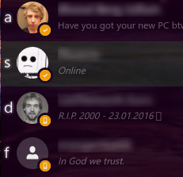
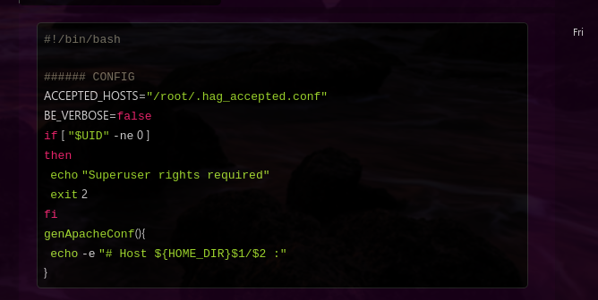
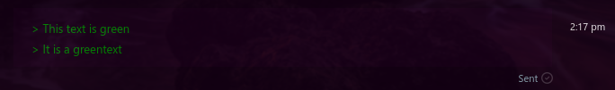
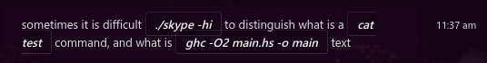

# PSkype
PSkype is a modification of webskype that aims to make Skype usable from the keyboard without the mouse. It also adds some other bits and pieces.

## Documentation
PSkype is modal (like Vim!), there are 3 modes:
* Chat mode
* Browse mode
* Find mode

#### Chat mode
In chat mode the chat box is selected, and you can write messages. Pressing escape puts you in browse mode.

#### Browse mode
The chat is selected, and you can press:
- `j` to scroll down
- `k` to scroll up
- `d` to scroll half a page down
- `e` to scroll half a page up
- `g` to scroll to the very top
- `G` to scroll to the very bottom
- `i` to enter chat mode
- `f` to enter find mode

#### Find mode
In find mode you have letters next to your conversations. Type a letter to go to that conversation and enter chat mode.

## Other bits and pieces
#### Vim editor
Pressing Ctrl+i in any mode brings up a text editor with Vim emulation. `:w` writes the change to the chat box. It is still a work in progress

#### Inline syntax highlighting
If you send a message starting with `[CODE]`, this happens:

#### Greentexting
Any message starting with `>` will become green

#### Inline snippet things!
Anything inside backticks will become inline snippet things

